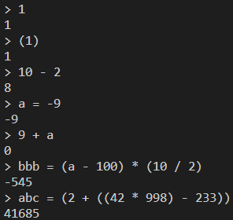

# Go 语言编程入门项目之 Galculator
__Introduction to Programming with Go's Project: Galculator__

Galculator is an educational project which teaches students how to write an interpreter for a tiny arithmetic language, a calculator repl if you wish.  

In this project, you will learn about Stack, Finite State Machine, Recursive Type Definition, Lexing/Tokenization, Object Oriented Design, Terminal IO and many advanced string/sequence manipulation techniques and concurrent programming.  

This project is amied for absolute beginners. But I believe it is also educational for professional programmers.  

本项目致力于教会学生如何写一个简易的解释器（一个基于命令行的交互式计算机）。

在这个项目中，你会学到很多数据结构与算法的应用，比如：栈、有限状态机、递归结构、符号化、面向对象设计、命令行输入输出、和大量的高级字符串/序列处理技巧以及并发编程。

这个项目是为了绝对初学者而设计的。不过我相信很多职业程序员也可以从中受益。

## Chapter 1 The Fundemental of Programming and Basic Math Operations
编程基础和基本的数学

In this chapter, you will learn about basic math operations in Go and how to convert a string `"1+1"` into a data structure in Go and get the result `2` back as a string `"2"`. You will learn the fundenmental building blocks of programming such as `Variable`, `Function`, `Type`, `String`, and of course, a little amount of Math!

在这一章节中，你会学习到基本的编程概念和这些概念在 Go 中的表现以及应用。你会学习到变量（Variable）、函数（Function）、类型（Type）、控制流(Control Flow)、循环（Loop）、条件（if/else）、以及一些简单的数学编程。

# Chapter 2 Control Flow and Data Structures
控制流和数据结构

In this chapter, you will learn several useful data structures such as `Array/Slice`, `Stack`, `Queue`. You will also learn different types of control flow such as `if/else`, `switch`, `for`loop which are necessary in order to interact with data structures.

在这一章节中，你会学习更多的控制流和数据结构。我们会强调 4 个数据结构：数组（Array）、切片（Slice）、栈（Stack）、队列（Queue）。其中，栈和队列是抽象数据结构。我们会讲到抽象数据结构和面向对象编程的一些关系。我们也会学习如何自定义新的类型和数据结构。

# Chapter 3 IO
输入输出

You will learn basic IO in Go and know how to interact with user input from the terminal. You will learn some basics of how to structure your programm and make everything well organized.

# Chapter 4 Lexing/Tokenization, Finite State Machine, Regular Expression and Recursive Structure!
符号化、有限状态机、正则表达式和递归结构！

This chapter might be one of the most important chapter of the whole course!

You will enter to realm of programming language for real(sort of)! You will learn a lot about `recursive structure` and `recursion`. We will dig deeper into data structures and learn about `Tree` and its relationship with `Stack`. We will discuss more advanced `string/sequence` manipulation techniques.

We will also learn a powerful tool known as `Regular Expression` and see its relationship with `Finite State Machine`.

Finally, we will write a formal lexer/tokenizer to process math expressions such as `42 + (233 * (666 - 998) / 502)`.

You will become a `Finiate State Machine` master/monster after this chapter!

# Chapter 5 Object Oriented Design

# Chapter 6 Concurrent Programming
